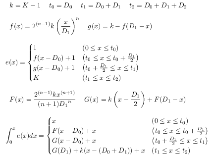
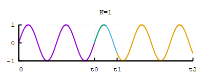

# Sine Wave

Sine wave generation playground. Documented things are work in progress,
and not guaranteed as proper solutions.

## Sine Sweep

|    | Description                     | Unit   |
| -- | ------------------------------- | ------ |
| x  | current time (starts with 0)    | second |
| H  | initial frequency               | hertz  |
| n  | easing factor                   |        |
| K  | frequency multiplier            |        |
| D0 | initial frequency duration      | second |
| D1 | easing duration                 | second |
| D2 | K-fold frequency duration       | second |
| D  | wave duration (= D0 + D1 + D2)  | second |

To change frequency of wave, at first, focus on acceleration of time `e(x)`.
`e(x)` goes from `1`(current freq.) to `K`(K-fold freq.).
And its integral `E(x)` is described as "distored time".

`n` provides easing function as follows:

| n    | easeing function    |
| ---- | ------------------- |
| 1    | linear ease         |
| 2    | quadratic ease      |
| 3    | cubic ease          |
| 4    | biquadratic ease    |
| 5    | quintic ease        |

Finally, formula is defined as follows:

## License

Authored by Retorillo

No Rights Reserved (CC0)

